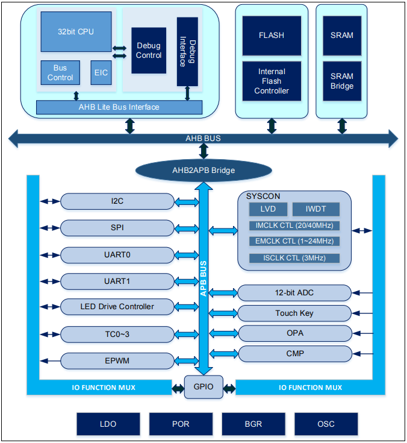

# [APT32F172](https://github.com/SoCXin/APT32F172)

#### [Vendor](https://github.com/SoCXin/Vendor) ：[APT](http://www.aptchip.com/)
#### [Core](https://github.com/SoCXin/RISC)：[C-Sky](https://github.com/SoCXin/RISC)
#### [Level](https://github.com/SoCXin/Level) ：20 MHz * 0.9 DMIPS/MHz

## [简介](https://github.com/SoCXin/APT32F172/wiki)

[APT32F172](https://github.com/SoCXin/APT32F172)基于 C-Sky开发的 32 位单片机核的高性能低成本单片机。APT32F172 单片机面向的应用为变频控制，马达驱动，功率检测等应用。

#### 关键特性

* LED(8x8),8个大电流驱动的管脚(每个管脚最大120mA)
* 2 x OPA (OPA0:1/2/3/4/5/6/7/8,OPA1:1/10/20/40/60/80/100/120),输出可以作为ADC的采样输入
* 5 x CMP (可以独立选择内部248个参考电压)
* 2 x UART
* ADC 18 x 12 bit x 500KSPS
* 16 bit增强型独立 PWM 模块，支持三路带死区控制的互补输出，支持与比较器联动工作（EPWM）

### [资源收录](https://github.com/SoCXin/APT32F172)

* [参考文档](docs/)
* [参考资源](src/)
* [参考工程](project/)

### [选型建议](https://github.com/SoCXin)

[APT32F172](https://github.com/SoCXin/APT32F172)

###  [www.SoC.xin(芯)](http://www.SoC.Xin)
